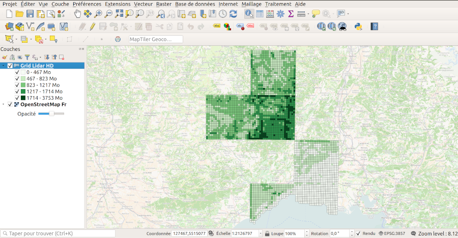

# Project to download LIDAR HD grid

The goal is to get a GeoJSON grid with all the infos from each tile so you can integrate in 3rd party tool the GeoJSON for any purpose.

You can use the direct download link to each grid tile and it size.

For instance, you could use the GeoJSON:

- to predict the size of files to download on an area
- know if the data is available on your area. Whole country coverage is the target but before it's achieved, it's a way to get work advancement on the delivery part
- ease batch download by selecting multiple tiles and providing a list of URLs to download

## QGIS basic example

You can open a basic project named `lidar-hd-grid.qgz` that contains a thematic map with file size for each tile that reuse the GeoJSON




## Principles for retrieving infos

It retrieves firstly from a 1st remote XML a list of grid and transform to GeoJSON.

From this list, several http calls to get each grid file infos (size and filename) are done.

Thus, additionnal keys are added to GeoJSON

## How to run manually

We launch every week the process to get the latest GeoJSON using a Github action but if you want to run the script manually, do

```bash
git clone https://github.com/ThomasG77/lidar-hd-grid.git
cd lidar-hd-grid
npm i
node download-lidar-hd.js
```

You will get a resulting file `grid_lidar_hd_ign_with_related_infos.geojson`
 
